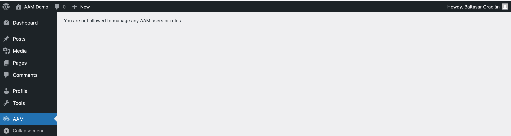
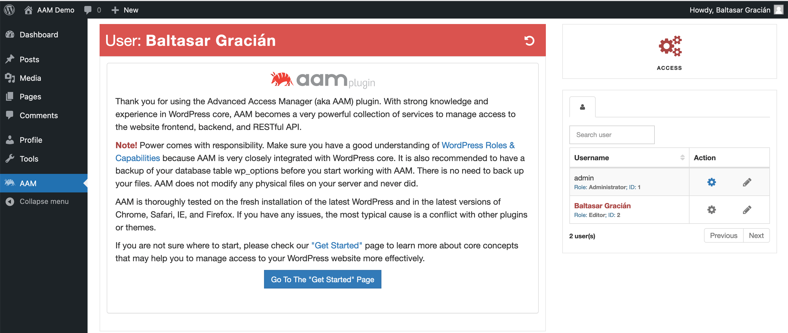
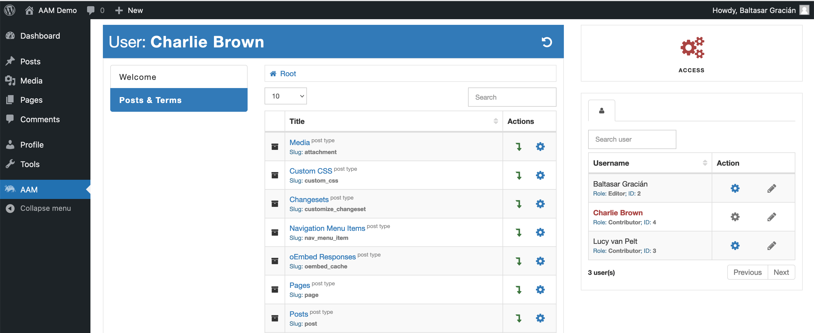

::: question Question
I have a group of editors that we would like to give the ability to manage access only to posts and pages with AAM. They should be able to do that only for individual users. How can I accomplish this task?
:::

Sometimes there is a need to give access to non-administrator users to manage access to specific website resources like posts, pages, metaboxes, widgets, or API endpoints. However, you may not want to give too many privileges like changing capabilities or creating new roles. That is why AAM provides the flexibility to define granular access to the AAM page and its services. In this article, we'll unpack all you need to know to manage access to AAM services.

By default, access to AAM functionality is granted only to the user with the `administrator` capability (typically only users with _Administrator_ role). However, to allow access to AAM services for other non-administrator users, you can create and grant custom capabilities, and the rest of the article explains it all in greater detail.

## Initial Considerations
When you need to give access to AAM functionality to other users,  consider the possibility of human error. Always allow access **only to what is necessary** for other users to do their job. For example, if you have a group of editors that need to manage only access to content for individual users, then grant access only to the _Posts & Terms_ service with the ability to manage only between users.

## Setup access to the AAM interface

The initial step is to set up access to the AAM interface by redefining its default capability. As mentioned earlier, only a user with `administrator` capability can access AAM. It is the first authorization layer to verify that the user can work with AAM services.

Create a custom capability `aam_manager`. Go to the _Capabilities_ tab and select the _Create_ button. It signals AAM that only users with the `aam_manager` capability can work with AAM functionality. Make sure that you do not misspell `aam_manager` capability. The letter R is at the end!

::: info FYI!
To learn more about managing custom capabilities, check [How to create a custom capability?](/question/wp-role-capability/how-to-create-capability) question.
:::

When you grant this capability to any role or user, the _AAM_ menu item becomes available for the user on the main Admin menu. However, that does not yet allow the user to manage access controls.

## Define what roles & users can be managed

AAM allows managing access controls to all roles, individual users, visitors, and default access altogether. It is important to keep this in mind and grant the ability to manage only what the user needs. For example, if editors need to manage access controls for content and only for individual users, then do not allow them to manage roles or visitors.

AAM has a granular way to set up these permissions with the help of a few custom capabilities.
- The `aam_manage_roles` custom capability grants access to list and manage all roles.
- The `aam_manage_users` custom capability grants access to the list of users with the ability to manage them.
- The `aam_manage_visitors` custom capability is for visitors (anonymous users).
- The `aam_manage_default` custom capability allows to manage the default access controls for all users, roles, and visitors.

If you created and assigned any of these capabilities properly, your users should be able to see and switch between allowed roles and users.

::: info FYI!
From the screenshot above, you might notice that the non-administrator users, can see and manage the `admin` user. This might not be an ideal behavior and you would want to protect your higher-privileged users from being managed by lower-privileged users. Check the [How does AAM users and roles filter work?](/question/users-roles/wp-user-role-filters)
:::

Ok, so at the moment, your desired users can access the AAM interface and see the list of users that they can manage. However, you still have to grant access to each AAM service independently.

## Grant access to manage AAM services

Think about AAM as the collection of services like _Backend Menu_, _Metaboxes, or _URI Access_. Each service is protected with a custom capability that you can create and assign to users that need to have access to them.

At the moment of writing this article, AAM supports the following list of service custom capabilities.
- The `aam_manage_admin_menu` grants access to the _Backend Menu_ service.
- The `aam_manage_toolbar` grants access to the _Toolbar_ service.
- The `aam_manage_metaboxes` grants access to the _Metaboxes & Widgets` service.
- The `aam_manage_capabilities` grants access to the _Capabilities_ service. **Note!** Avoid granting access to manage capabilities for users that are not administrators.
- The `aam_manage_content` grants access to the _Posts & Terms` service.
- The `aam_manage_api_routes` grants access to the _API Routes_ service.
- The `aam_manage_access_denied_redirect` grants access to the _Access Denied Redirect_ service.
- The `aam_manage_login_redirect` grants access to the _Login Redirect_ service.
- The `aam_manage_logout_redirect` grants access to the _Logout Redirect_ service.
- The `aam_manage_404_redirect` grants access to the _404 Redirect_ service.

For example, when you grant the `aam_manage_content` capability to your users, they should be able to see and manage access to the website content on the _Posts & Terms_ tab.

Additionally, AAM defines `aam_manage_settings` and `aam_manage_addons` custom capabilities that grant access to AAM settings and Add-Ons pages respectively.

## Conclusion

Managing access to the AAM interface and services is done with the help of custom capabilities. When you need to allow non-administrator users to define access controls for your website resources, always apply the least privilege approach. In other words - grant access to only what is necessary.

With a few custom capabilities, you can control access to individual AAM services. You also can define if your non-administrator users allow managing other roles, users, visitors, or default access altogether.

