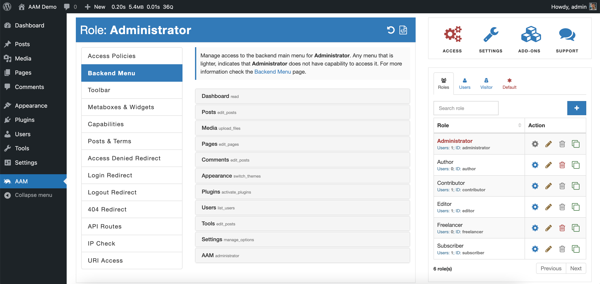
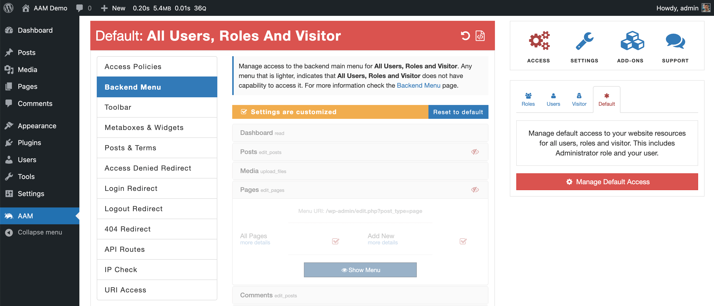
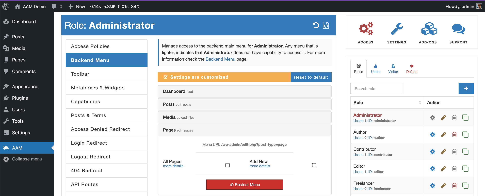

::: question Question
I have a group of users that I need to give access only to a few plugins and occasionally override these settings for one or two users.

Can you explain how the access controls/settings inheritance works in AAM?
:::

WordPress CMS manages different types of information - from simple _tags_ and _posts_ to users and roles. Nothing in WordPress exists in complete isolation, and things relate to each other either directly or indirectly.

For example, a single _post_ always has a category, while a category may have another parent category. Pages have authors where authors are WordPress users with one or more roles assigned. Roles have capabilities and even [can have parent roles](/plugin/premium-complete-package/role-hierarchy/multilevel-access).

Any WordPress resource (_post_, page, menu, _widget_, etc.) is **not** an independent entity. Always remember its relationship to other resources and what others can or cannot do with it.

Because everything in WordPress relates to each other in more like hierarchical order, it is natural to think that all the settings or properties should propagate down the hierarchical chain as well. For example, a WordPress user typically has one or [multiple parent roles](/plugin/advanced-access-manager/setting/multi-role-support) assigned. So, the user inherits a combined list of capabilities from these roles.

Advanced Access Manager considers all the relationships between WordPress resources and users/roles and automatically inherits access settings and properties accordingly. Additionally, AAM introduces the concept of the “Default” settings that allows the administrator to define default access settings for users, roles, and visitors at once. The typical use case for defining default access controls is when you need to grant access to selected resources or actions only to one of a few users or roles.

### How does the inheritance work?

AAM divides all the access control into a few levels, where the top level is the "Default Level" followed by the "Roles Level" and "User Level". The image below visually shows how the access controls propagate back to the end user.

Access controls propagate down the chain where "lower levels" can override any controls inherited from the "higher levels". That is what makes AAM so flexible because you can define some default access controls for everybody and then fine-tune them for any role or even individual user.

::: center

:::

### Example

In this example, we deny access to manage regular WordPress posts and pages for all users and roles. However, we override this restriction for the administrators and _Freelancer_ custom role.

::: info Note!
The "Freelancer" is a custom role created for demo purposes. To learn more about creating a custom role, refer to the [How to create a custom role?](/question/users-roles/how-to-create-role) Q&A.
:::

First, we need to configure the default access controls for everybody. On the "Users & Roles widget", switch to the "Default" tab and select the "Manage Default Access" button. It is the access controls level that **all** users, roles, and visitors inherit. Without it, you would have to go to each role and configure access controls one by one (tedious work if you have a dozen roles or more).

On this level, navigate to the [Backend Menu](/plugin/advanced-access-manager/service/backend-menu) tab and restrict the entire menu _Posts_ and _Pages_. From now on, even your administrator role will not be able to see or directly navigate to manage any default WordPress posts or pages (give a try just by selecting the Posts or Pages menu item).

::: info FYI
You may notice that all the menu items are faded. It is because the default level is not a WordPress core entity, so it does not have any capabilities. Refer to the [Backend Menu](/plugin/advanced-access-manager/service/backend-menu) page for more information.
:::

The next step is to override these default controls for the _Administrator_ and _Freelancer_ roles. Switch to the "Roles" tab on the "Users & Roles widget" and select the "Administrator" role.

On the [Backend Menu](/plugin/advanced-access-manager/service/backend-menu) tab select "Show Menu" for _Posts_ and _Pages_, and you should immediately see the yellow "Settings are customized"  banner. It is the visual indication that overrides detected for the managing role.

Do the same for the _Freelancer_ role, and you are good to go.