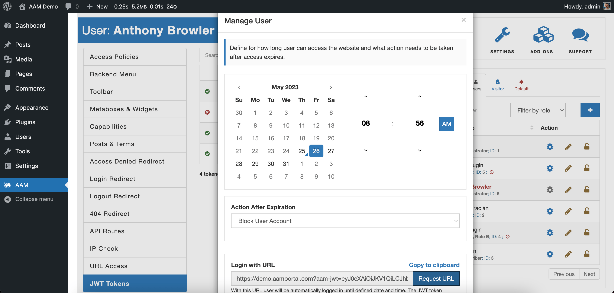

::: question Question
I need to give temporary access to one user. However, I do not want to share my username/password with them. How can I do that?
:::

In your case, you are looking for passwordless authentication. In other words - the ability to login to the website with a specifically signed URL. The free Advanced Access Manager plugin can issue signed URLs on the [Users & Roles Widget](/plugin/advanced-access-manager/ui-overview#access-page). Select the "edit" button for the desired user on the "Users" tab, and the pop-up modal provides the ability to configure signed URL attributes.

Each signed URL has to have the expiration date and, if necessary - the action that automatically triggers after login expires. For example, you can automatically logout the user, block them, change the role or even delete the user.

Technically speaking, the "signed URL" is just a link to your website's homepage with added query parameter `aam-jwt` that contains a unique JWT token.

When necessary, you can revoke passwordless access to the site by deleting the issued JWT token for that user on the [JWT Tokens](/plugin/advanced-access-manager/service/jwt) tab.