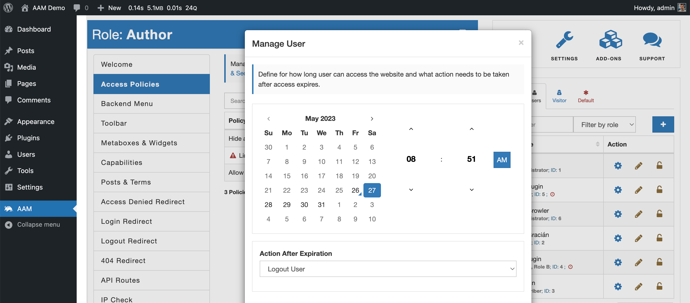
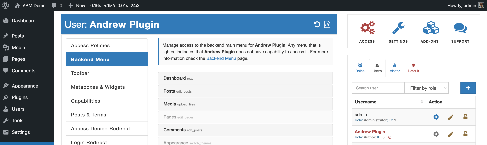

The [Users & Roles Widget](/plugin/advanced-access-manager/ui-overview#access-page), when you select the "Users" tab, contains the list of all user accounts on your website. You can define the expiration date by selecting the "edit" icon. This brings the "Manage User" modal.

Here you can choose the date & time when user access will be revoked and type of action to trigger. At the moment, AAM allows you to pick the following options:

- Logout User. The user will be automatically logged out, though, if they have valid username/password, they will be able to re-login to the website. That is why we encourage to use the [passwordless authentication](/question/authentication/passwordless-login).
- Delete Account. Completely delete user account from the database.
- Change User Role. Change current user role to a different one. It is  helpful when you want to grant elevated privileges to a user for limited time-frame.
- Block User Account. Logout user and lock their account. This way, user cannot login to the website unless administrator unlock them.

The "Manage User" modal also has the ability to request a passwordless URL that you can give to the user instead of username/password pair. For detail about this feature, refer to the [What is the passwordless login?](/question/authentication/passwordless-login) Q&A.

When you select the "Save" button on the modal, the "clock" indicator right next to the user visually shows that they have configured a temporary access to the site.

