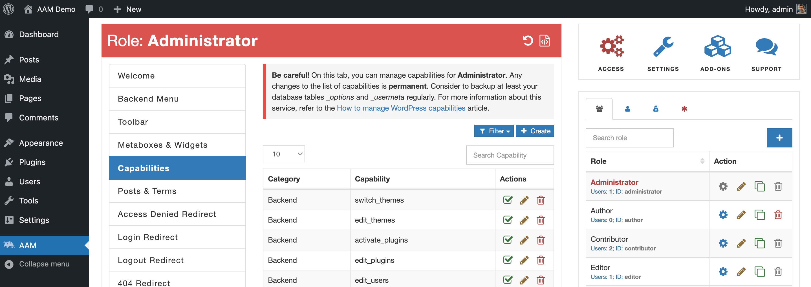
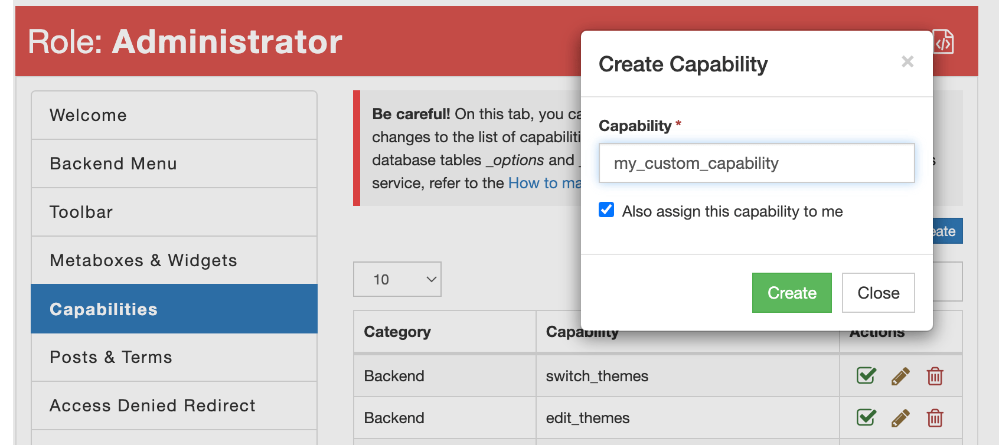

You can manage existing and create new _capabilities_ on the AAM page under the _Capabilities_ tab.

It is a good practice to switch to the _Administrator_ role before creating a custom capability to guarantee that the website administrators always have the complete list of _capabilities_.

When you select the "Create" button, the displayed modal allows you to enter the custom capability. Keep in mind that AAM takes the entered _capability_ as-is with the following exceptions:

- Checks for invalid UTF-8.
- Converts single < characters to entities.
- Strips all tags.
- Removes line breaks, tabs, and extra whitespace.
- Strips octets.

::: info FYI!
It is the best practice to follow the naming convension and name your custom capability all lower-cased and separated with underscores `_` between words. For example, `allow_manage_orders`.
:::

The "Also assign this capability to me" checkmark signals AAM to assign this custom capability to your user. Avoid selecting this checkmark when you create a _capability_ for the role that you have. This is a redundant operation.