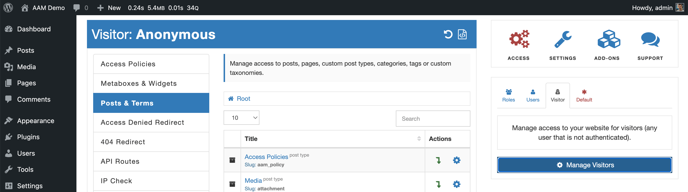
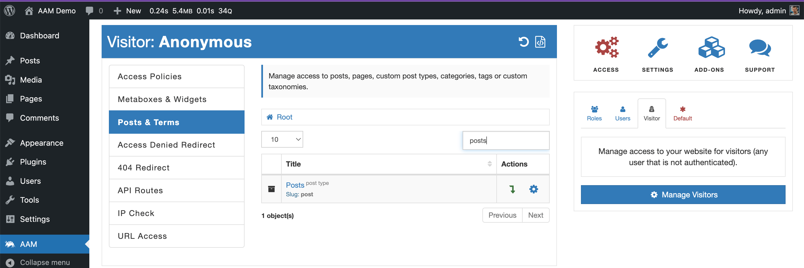
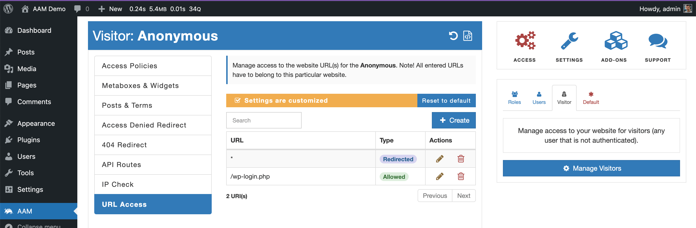
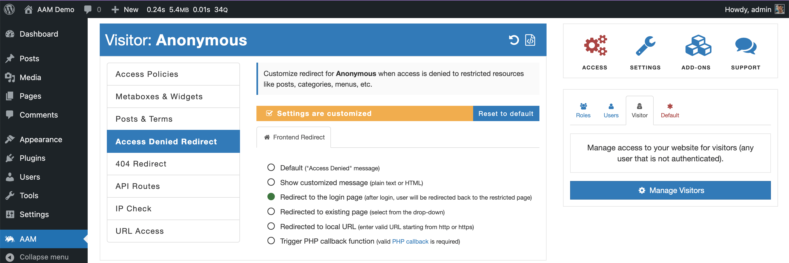

::: question Question
Is it possible to restrict access for visitors to all my content? In other words, I would like to redirect a visitor to the login form before they can access any of my posts or pages.
:::

AAM offers various tools to manage access to your content. However, before describing the steps, we should decide on the type of content to protect. There are posts, pages, custom theme pages, files, or the whole website. So, the following explains how to set proper access control to each type of content.

::: info FYI!
In all the instances, make sure that on the AAM [User & Roles widget](/plugin/advanced-access-manager/ui-overview#access-page), you switched to manage "Visitors".

:::

### Restrict Posts & Pages

Any post, page, or custom post type can be protected with AAM [Posts & Terms](/plugin/advanced-access-manager/service/post-term) service. When you navigate to the "Posts & Terms" tab, you can see the list of registered post types and taxonomies. We call it the "Root" level, and you can set the default access controls to any post type if you have the premium [Complete Package](/premium). All the access controls will propagate down to individual posts or pages as explained in the [How is WordPress content organized?](/question/content-access/wordpress-content-organization) Q&A.

For example, if you need to restrict access to all your posts, on the "Posts & Terms" tab, find the row with the post type with _Slug_ `post` and then select the "Manage Access" gear button.

In the loaded form select the [RESTRICTED](/plugin/advanced-access-manager/service/post-term#post-access-controls) option. It immediately restricts access for visitors to all your posts.

You can repeat the same steps for the post type `page` or any registered post type.

### Restrict URLs

To restrict any URLs to pages that are not post types (e.g. custom theme page), use the [URL Access](/plugin/advanced-access-manager/service/url) service. Here you can either list all URLs one by one or apply the wildcard.

### Restrict Files

To restrict access to the physical files, install our free [Protected Media Files](/plugin/protected-media-files/) plugin. There is a decent amount of documentation [here](/plugin/protected-media-files/installation) that helps you to understand how to set up the plugin and define access controls to your files.

### Restrict the Entire Website

To protect the entire website from visitors, you can use the [URL Access](/plugin/advanced-access-manager/service/url) and define to rule. The first one is wildcard `*` with a redirect to the login page `/wp-login.php`, and the second rule allows accessing the actual login page.

::: info FYI!
You must have the [Complete Package](/premium) to use the wildcard denotation. If your login page is not the default WordPress login, then  adjust the second rule accordingly.
:::

### Access Denied Redirect

When you manage access with the [Posts & Terms](/plugin/advanced-access-manager/service/post-term) service, you should consider defining access denied redirect. This way, a visitor is redirected to the login page when access is denied.

