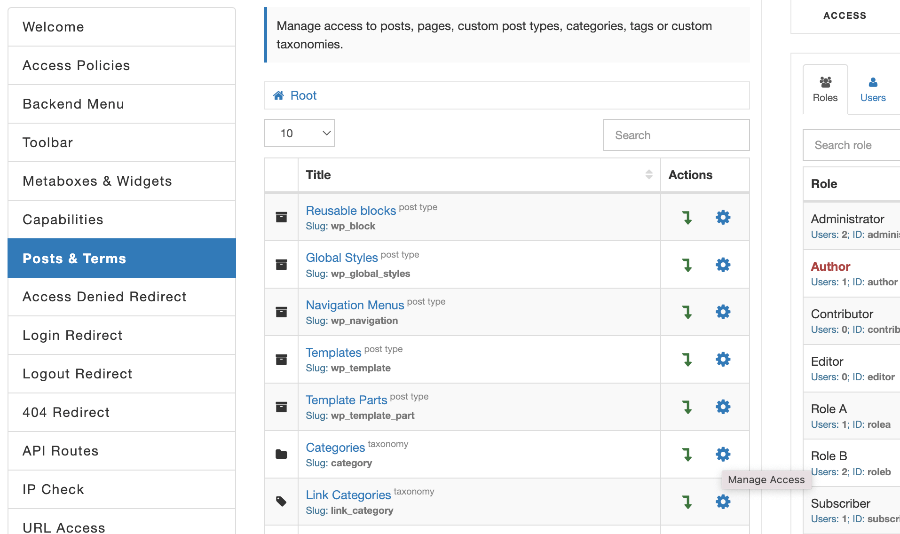
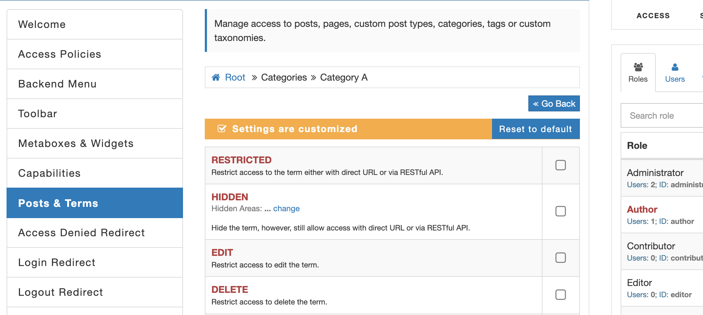
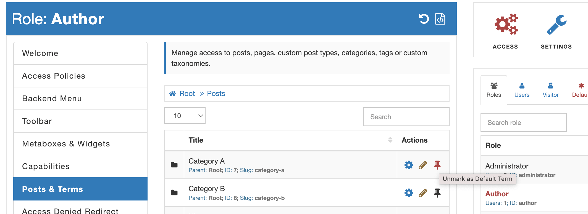
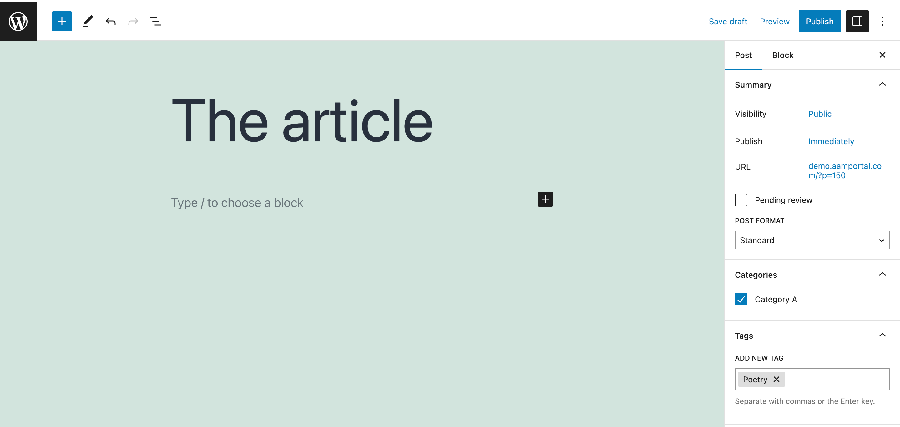

::: question Question
We have five groups of authors. We want each group of authors to be able to create articles only in a specific category.
:::

::: info Note!
This feature requires the premium [Complete Package](/premium).
:::

It is a clear requirement, though it requires a couple of considerations. So, let's unpack them all. For simplicity, the remainder of this article uses the word _term_ to refer to categories, tags, or custom taxonomies.

When multiple _terms_ have to be segmented for contributors, the first question that needs to be answered is - **Do you want your contributors (authors) to be able to see and select all _terms_?** The common sense may be that there is no reason to list _terms_ that contributors can't create articles for. So, in this case, you should hide all _terms_ first and then handpick one or more _terms_ that you want to show. However, you may trust your authors to select the right _terms_ for the articles. In this case, you may choose to show all _terms_, and to improve their experience, you would want to redefine the default (pre-selected) _terms_.

For example, you want to hide all Post Categories but "Category A". Go to [Posts & Terms](/plugin/advanced-access-manager/service/post-term) tab and select the "Categories" taxonomy (pay extra attention to the _slug_ as there can be multiple custom taxonomies that are named as "Categories") and then make it HIDDEN for the backend and RESTful API areas. The second area is mandatory if you use the Gutenberg editor because it uses the [WordPress RESTful API](https://developer.wordpress.org/rest-api/).

It sets the default access to all categories and hides them. The next step is to override these default access controls for the "Category A" term. Drill down to the "Categories" taxonomy and re-define the access controls for your desired category.

The next step in this process is to re-define default _terms_. These _terms_ will be automatically pre-selected for any newly created posts or posts that are saved without selected _terms_.

To do this, go to [Posts & Terms](/plugin/advanced-access-manager/service/post-term) tab and select the post type you need to re-define the default _terms_. For our example, we choose the "Posts". You notice that each _term_ has the additional "pin" button right next to them. By selecting this button, you set the _term_ as default. You can choose multiple _terms_ and for this exercise, we'll select the category "Category A" and tag "Poetry".

From this point, any newly create post by author will have automatically pre-selected default _terms_. In our case - the "Category A" and tag "Poetry".

