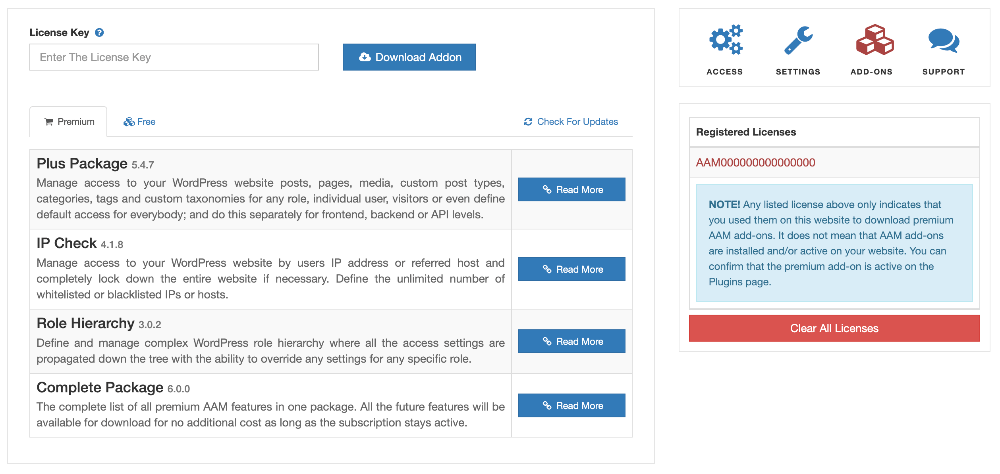

::: question Question
I can't find my license key anywhere but I know for fact that we purchased it as some point. Can you help me?
:::

There are several steps that you can do on your end that may help to allocate your license key before contacting our support.

First, check your email inbox for any emails from the `support@aamplugin.com` sender. To be sure, please check junk and spam folders as well. Commonly, our customers use different email addresses for purchases, like _procurement@somedomain.com_ or _licensing@example.com_, so please make sure that you check your company's email boxes or ask your teammates.

If you have no luck, the next step is to check your website. Go to AAM and navigate to the "Add-Ons" tab. If you have the [Advanced Access Manager](https://wordpress.org/plugins/advanced-access-manager/) `v6.9.3+`, you may be able to allocate your license here.

.

Finally, if there is still nothing, the next step is to contact us. Send us an email to [support@aamplugin.com](mailto:support@aamplugin.com) or schedule a quick Zoom call [on this page](https://calendly.com/vasyltech/15min).

The only thing that we require is proof that you may own the license. So things like PayPal transaction ID or last four digits or credit card and date of purchase or renewal auto draft. Sometimes we can use your company's domain and find all licenses that are associated with it. This is a common use case when a former employee is no longer with the company. The main point here is that we will work with you to find a license key if we have reasons to believe that you may own it.

We **can not** assist you if the only proof that you can provide is a domain where the license could be used.