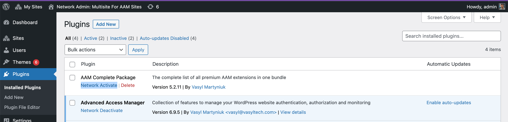

::: question Question
We are considering installing AAM on our site, and will be using granular access to pages, taxonomies, etc, so we plan to purchase the Complete Package. However, our site is a multi-site on a single domain. There are several sub-sites in that domain for different departments (`example.com/admissions`, `example.com/library`, etc). We're hoping we don't need to buy the enterprise edition. Will Complete Package make AAM work across all our sub-sites in our domain?
:::

In the nutshell, the WordPress multi-site setup in a single physical instance of WordPress. It is just logically divided into one or more sub-sites. Typically all sub-sites are part of the same domain with slightly different URI paths (e.g. `https://example.com/site-a`, `https://example.com/site-b`, etc.)

If you have your multi-site setup this way, then you really need only one license with the default 3 website limits. All sub-sites are part of the same domain.

However, if you have a multi-site where each sub-site is hosted on a subdomain (e.g. `https://site-a.example.com`, `https://site-b.example.com`, etc), our system may see them as independent websites and react accordingly. In this case, you have to make sure that the premium Complete Package is installed and activated through the multi-site network admin panel instead of on each individual sub-site to avoid your sub-sites pinging our server.

.

Even if you noticed that your sub-sites starting to count as independent domains (you can see that on your license page under "Activations"), jet let us know and we'll adjust the records and your subscription accordingly.

**To summarize**. The entire multi-site network that runs on a single WordPress instance we consider as a single domain.