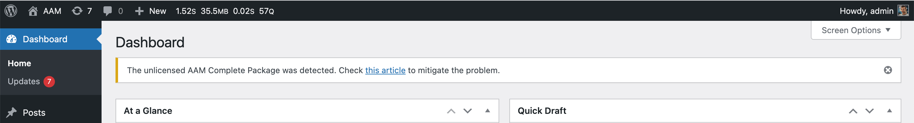

::: question Question
I see the "The unlicensed AAM Complete Package was detected" message on my WordPress admin panel. What should I do?
:::

If you received the "The unlicensed AAM Complete Package was detected" notification on your WordPress admin panel, it indicates that you have altered the AAM Complete Package plugin.

In this case, go to [the license page](/license), enter your license key and download the Complete Package add-on. Then re-install it following the [How to install the Complete Package?](/question/aam-premium/install-premium-complete-package) guidance.

::: info FYI!
To avoid poor user experience, The "The unlicensed AAM Complete Package was detected" is visible only to the users that can install, update or delete plugins on your websites. Your subscribers, contributors, or editors **do not** see this message.
:::