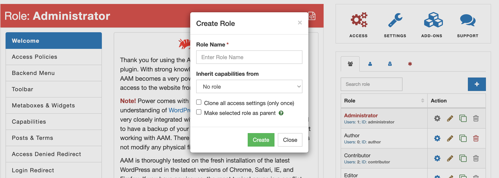

<YouTube id="91oxAT3ahJ4" />

Custom role creation is a straightforward process. Go to the AAM page, and on the _Roles & Users_ widget select the "Create New Role" button (a blue square button with a plus icon). It brings the "Create Role" modal. Here you can enter your role's name, and optionally select which one to use to copy a list of capabilities or settings.

If you have the Complete Package premium add-on, you can make the newly created custom role a child to the selected role. Check the "Make selected role as a parent" and all the access controls from the parent role will automatically propagate to a child role. You can learn more about this functionality from the [Create multi-level access to your WordPress website](/plugin/premium-complete-package/role-hierarchy/multilevel-access) article.